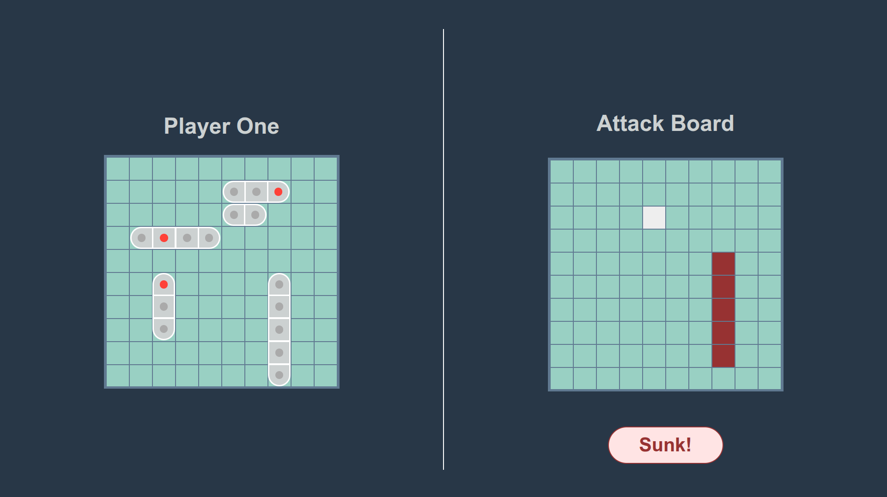

# Battleship Game

A browser-based implementation of the classic **Battleship** game built with **HTML**, **CSS**, and **JavaScript**. Players can battle head-to-head on the same computer or play against an AI opponent.

## Features

- **Two Game Modes:**
  - **Player vs Player:** Two players take turns on the same device.
  - **Player vs Computer:** Challenge a basic AI opponent.
- **Interactive Game Boards:** Drag-and-drop or click-to-place ships (if applicable), and click to attack.
- **Turn-Based Gameplay:** Automatic switching between players.
- **Win Detection:** Game ends when all ships of one player are sunk.

## Technologies Used

- **HTML5** for game structure
- **CSS3** for styling
- **JavaScript (ES6+)** for game logic and DOM manipulation

## Live Demo

[Live Demo](https://kylepunta.github.io/Battleship)

## Screenshots




## How to Play

1. Place your fleet of ships on your grid.
2. Players (or the AI) take turns selecting coordinates to attack.
3. Hits and misses are displayed on the opponent’s board.
4. The first to sink all opposing ships wins.

## Installation & Setup

To run locally:

1. Clone the repository:
   ```bash
   git clone https://github.com/yourusername/battleship-game.git
